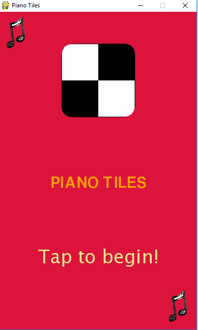
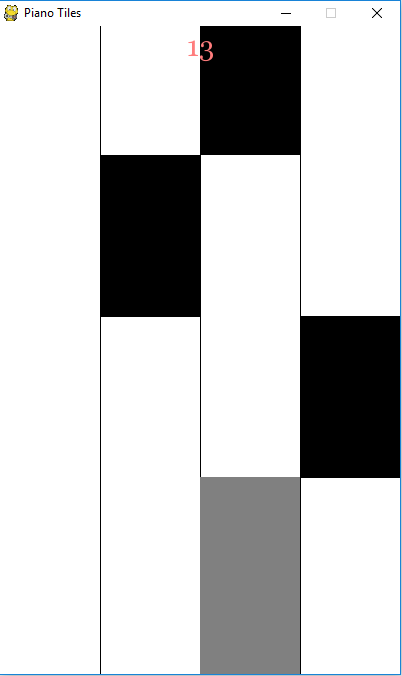

# Piano Tiles
  

This game is an implementation of Piano Tiles for Windows using pygame. It works well with mouse clicks but is built for touch screen windows devices.

## Requirements
* python
* pygame

## Platform
Currently this game is tested and run successfully on windows only.
